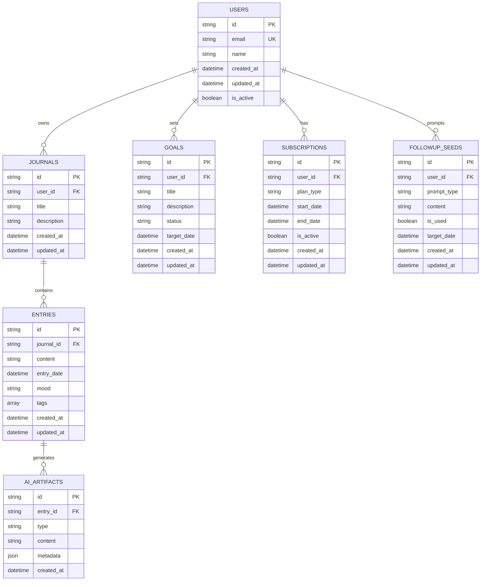

# ReflectionLab – Data Model (MVP)

## Entity Descriptions

### Users
The core user account entity that represents registered users in the system.
- `id`: Unique identifier for the user
- `email`: User's email address (unique)
- `name`: User's display name
- `created_at`: Timestamp of account creation
- `updated_at`: Timestamp of last account update
- `is_active`: Whether the account is active

### Journals
Collections of related entries created by users.
- `id`: Unique identifier for the journal
- `user_id`: Reference to the owner
- `title`: Journal title
- `description`: Optional journal description
- `created_at`: Timestamp of journal creation
- `updated_at`: Timestamp of last journal update

### Entries
Individual journal entries containing user reflections.
- `id`: Unique identifier for the entry
- `journal_id`: Reference to the parent journal
- `content`: The entry's text content
- `entry_date`: The date the entry refers to
- `mood`: User's mood during the entry
- `tags`: Array of tags/categories
- `created_at`: Timestamp of entry creation
- `updated_at`: Timestamp of last entry update

### Goals
User-defined goals and objectives.
- `id`: Unique identifier for the goal
- `user_id`: Reference to the goal owner
- `title`: Goal title
- `description`: Detailed goal description
- `status`: Current status (e.g., "in_progress", "completed")
- `target_date`: Target completion date
- `created_at`: Timestamp of goal creation
- `updated_at`: Timestamp of last goal update

### AI Artifacts
AI-generated insights and analysis from entries.
- `id`: Unique identifier for the artifact
- `entry_id`: Reference to the source entry
- `type`: Type of artifact (e.g., "insight", "summary", "recommendation")
- `content`: The generated content
- `metadata`: Additional artifact metadata
- `created_at`: Timestamp of artifact creation

### Subscriptions
User subscription and billing information.
- `id`: Unique identifier for the subscription
- `user_id`: Reference to the subscriber
- `plan_type`: Subscription plan type
- `start_date`: Subscription start date
- `end_date`: Subscription end date
- `is_active`: Whether the subscription is currently active
- `created_at`: Timestamp of subscription creation
- `updated_at`: Timestamp of last subscription update

### Followup Seeds
AI-generated prompts for future reflection entries.
- `id`: Unique identifier for the seed
- `user_id`: Reference to the target user
- `prompt_type`: Type of prompt
- `content`: The prompt content
- `is_used`: Whether the prompt has been used
- `target_date`: Intended date for the prompt
- `created_at`: Timestamp of seed creation
- `updated_at`: Timestamp of last seed update 